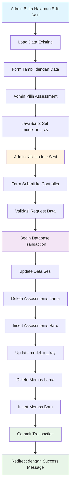
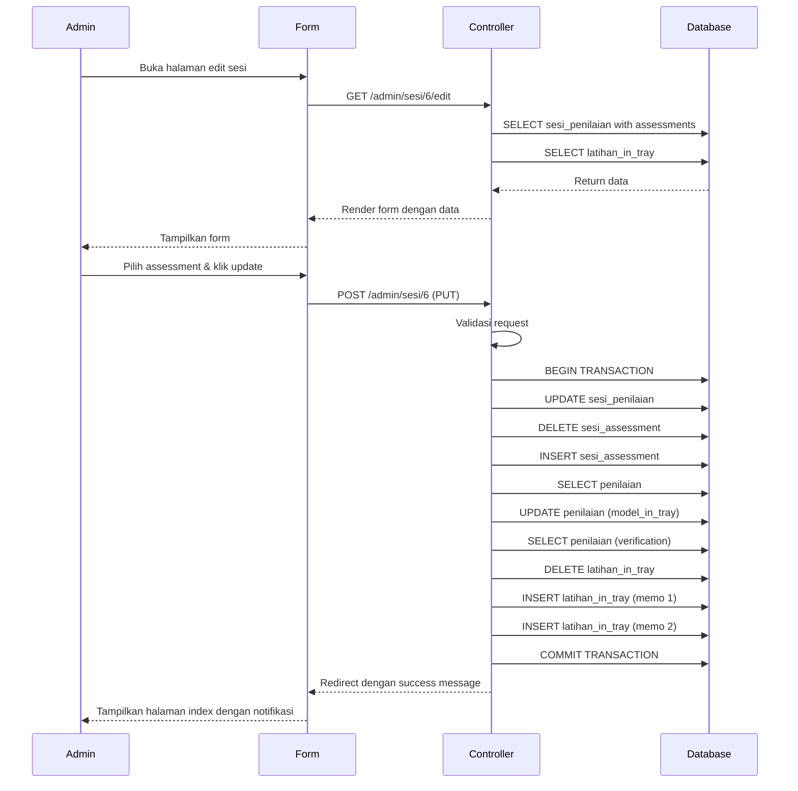

# Alur Update Sesi Assessment

## Overview
Dokumen ini menjelaskan alur lengkap proses update sesi assessment berdasarkan log database yang tercatat. Alur ini mencakup dari form submission hingga penyimpanan data ke database.

## Flow Diagram



## Detail Alur Berdasarkan Log

### 1. **Form Submission & Validation**
```
[2025-09-23 06:10:26] Sesi Update Request
```
- Form mengirim data ke `AdminController@sesiUpdate`
- Data yang dikirim:
  - `sesi_id`: 6
  - `nama`: "sesi tes berubah"
  - `durasi_menit`: null
  - `catatan`: "sesi tes intray berubah mode urutan atau prioritas"
  - `assessments`: Array dengan data assessment

### 2. **Database Transaction Begin**
```php
DB::beginTransaction();
```

### 3. **Update Data Sesi**
```
[2025-09-23 06:10:26] Database Query - UPDATE sesi_penilaian
Query: UPDATE sesi_penilaian SET nama = 'sesi tes berubah', durasi_menit = , catatan = 'sesi tes intray berubah mode urutan atau prioritas' WHERE id = 6
```
- Update tabel `sesi_penilaian` dengan data baru
- Field yang diupdate: `nama`, `durasi_menit`, `catatan`

### 4. **Delete Assessments Lama**
```
[2025-09-23 06:10:26] Database Query - DELETE sesi_assessment
Query: DELETE FROM sesi_assessment WHERE sesi_penilaian_id = 6
```
- Hapus semua relasi assessment lama untuk sesi ini
- Memastikan tidak ada data duplikat

### 5. **Insert Assessment Baru**
```
[2025-09-23 06:10:26] Database Query - INSERT sesi_assessment
Query: INSERT INTO sesi_assessment (sesi_penilaian_id, penilaian_id, urutan, durasi_default, instruksi_khusus, aktif) VALUES (6, 2, 1, NULL, '', 1)
```
- Insert relasi baru antara sesi dan assessment
- Data yang disimpan:
  - `sesi_penilaian_id`: 6
  - `penilaian_id`: 2 (In-Tray Exercise Urutan)
  - `urutan`: 1
  - `durasi_default`: NULL
  - `instruksi_khusus`: ''
  - `aktif`: 1

### 6. **Select Assessment untuk Update**
```
[2025-09-23 06:10:26] Database Query - SELECT penilaian
Query: SELECT * FROM penilaian WHERE id = 2 AND jenis = 'in_tray'
```
- Ambil data assessment untuk memastikan jenisnya in_tray
- Siapkan untuk update `model_in_tray`

### 7. **Update model_in_tray**
```
[2025-09-23 06:10:26] Updating model_in_tray
old_model: "urutan", new_model: "urutan"

[2025-09-23 06:10:26] Database Query - UPDATE penilaian
Query: UPDATE penilaian SET model_in_tray = 'urutan' WHERE id = 2
```
- Update field `model_in_tray` di tabel `penilaian`
- Dalam kasus ini: `urutan` → `urutan` (tidak berubah)

### 8. **Verifikasi Update**
```
[2025-09-23 06:10:26] Database Query - SELECT penilaian (verification)
Query: SELECT model_in_tray FROM penilaian WHERE id = 2
Result: "urutan"

[2025-09-23 06:10:26] Model updated successfully
```
- Verifikasi bahwa update berhasil
- Konfirmasi nilai yang tersimpan

### 9. **Delete Memos Lama**
```
[2025-09-23 06:10:26] Database Query - DELETE latihan_in_tray
Query: DELETE FROM latihan_in_tray WHERE sesi_penilaian_id = 6 AND penilaian_id = 2
```
- Hapus semua memo lama untuk assessment ini di sesi ini
- Mencegah duplikasi data

### 10. **Insert Memos Baru**
```
[2025-09-23 06:10:26] Database Query - INSERT latihan_in_tray
Query: INSERT INTO latihan_in_tray (penilaian_id, sesi_penilaian_id, konten_memo, urutan, aktif) VALUES (2, 6, '<p>memo 1 intray&nbsp;</p>', 1, 1)

[2025-09-23 06:10:26] Database Query - INSERT latihan_in_tray
Query: INSERT INTO latihan_in_tray (penilaian_id, sesi_penilaian_id, konten_memo, urutan, aktif) VALUES (2, 6, '<p>memo 2 intray</p>', 2, 1)
```
- Insert memo baru untuk assessment in-tray
- 2 memo disimpan dengan urutan 1 dan 2

### 11. **Commit Transaction**
```php
DB::commit();
```
- Commit semua perubahan ke database
- Jika ada error, rollback otomatis

### 12. **Redirect dengan Success Message**
```php
return redirect()->route('admin.sesi.index')
    ->with('success', 'Sesi berhasil diperbarui!');
```

## Sequence Diagram



## Key Points dari Log

### 1. **Assessment yang Dipilih**
- **Assessment ID**: 2
- **Nama**: "In-Tray Exercise (Urutan)"
- **Model**: "urutan" (drag-drop mode)

### 2. **Data yang Diupdate**
- **Sesi**: Nama dan catatan berubah
- **Assessment**: Tetap menggunakan assessment ID 2
- **Model**: Tetap "urutan" (tidak berubah)
- **Memos**: 2 memo baru disimpan

### 3. **Query Pattern**
1. **SELECT** → Ambil data existing
2. **UPDATE** → Update data utama
3. **DELETE** → Hapus data lama
4. **INSERT** → Simpan data baru
5. **SELECT** → Verifikasi hasil

### 4. **Transaction Safety**
- Semua operasi dalam transaction
- Jika ada error, rollback otomatis
- Data consistency terjaga

## Error Handling

### 1. **Validation Errors**
```php
$request->validate([
    'nama' => 'required|string|max:255',
    'assessments' => 'required|array|min:1',
    // ... validasi lainnya
]);
```

### 2. **Database Errors**
```php
try {
    // Database operations
} catch (\Exception $e) {
    DB::rollback();
    Log::error('Update failed: ' . $e->getMessage());
    return back()->withErrors(['error' => 'Update gagal']);
}
```

### 3. **Logging untuk Debug**
- Semua query di-log untuk debugging
- Request data di-log untuk trace
- Error messages di-log untuk troubleshooting

## Performance Considerations

### 1. **Query Optimization**
- Menggunakan transaction untuk batch operations
- Index pada foreign keys
- Efficient WHERE clauses

### 2. **Memory Management**
- Delete data lama sebelum insert baru
- Batch operations dalam transaction
- Proper error handling

### 3. **Logging Impact**
- Logging hanya untuk development/debugging
- Bisa di-disable di production
- Minimal performance impact

## Testing Scenarios

### 1. **Happy Path**
- Update sesi dengan assessment yang sama
- Update sesi dengan assessment berbeda
- Update sesi dengan memos baru

### 2. **Edge Cases**
- Update dengan data kosong
- Update dengan assessment tidak valid
- Update dengan memos kosong

### 3. **Error Cases**
- Database connection error
- Validation error
- Transaction rollback

## Monitoring & Debugging

### 1. **Log Analysis**
- Monitor query execution time
- Check for failed transactions
- Track error patterns

### 2. **Performance Metrics**
- Query count per update
- Transaction duration
- Memory usage

### 3. **Business Metrics**
- Update success rate
- User error patterns
- Data consistency checks
