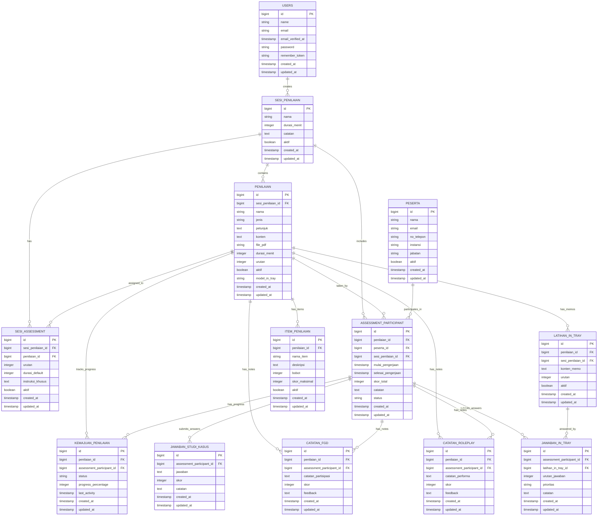

# Database Relationship Diagram - Assessment System

## Overview
Diagram ini menunjukkan relasi antar tabel dalam sistem assessment yang mencakup sesi penilaian, assessment, peserta, dan data terkait.

## Entity Relationship Diagram (ERD)



## Tabel Utama dan Fungsinya

### 1. **SESI_PENILAIAN**
- **Fungsi**: Menyimpan data sesi penilaian
- **Relasi**: One-to-Many dengan PENILAIAN, SESI_ASSESSMENT, ASSESSMENT_PARTICIPANT
- **Key Fields**: `id`, `nama`, `durasi_menit`, `aktif`

### 2. **PENILAIAN**
- **Fungsi**: Menyimpan master data assessment (studi kasus, in-tray, roleplay, FGD)
- **Relasi**: One-to-Many dengan SESI_ASSESSMENT, ASSESSMENT_PARTICIPANT, LATIHAN_IN_TRAY
- **Key Fields**: `id`, `nama`, `jenis`, `model_in_tray`

### 3. **SESI_ASSESSMENT**
- **Fungsi**: Menyimpan relasi antara sesi dan assessment dengan konfigurasi khusus
- **Relasi**: Many-to-One dengan SESI_PENILAIAN dan PENILAIAN
- **Key Fields**: `sesi_penilaian_id`, `penilaian_id`, `urutan`, `instruksi_khusus`

### 4. **PESERTA**
- **Fungsi**: Menyimpan data peserta assessment
- **Relasi**: One-to-Many dengan ASSESSMENT_PARTICIPANT
- **Key Fields**: `id`, `nama`, `email`, `instansi`

### 5. **ASSESSMENT_PARTICIPANT**
- **Fungsi**: Menyimpan data partisipasi peserta dalam assessment
- **Relasi**: Many-to-One dengan PENILAIAN, PESERTA, SESI_PENILAIAN
- **Key Fields**: `penilaian_id`, `peserta_id`, `sesi_penilaian_id`, `status`

## Tabel Khusus per Jenis Assessment

### 6. **LATIHAN_IN_TRAY**
- **Fungsi**: Menyimpan memo untuk assessment in-tray
- **Relasi**: Many-to-One dengan PENILAIAN dan SESI_PENILAIAN
- **Key Fields**: `penilaian_id`, `sesi_penilaian_id`, `konten_memo`, `urutan`

### 7. **JAWABAN_IN_TRAY**
- **Fungsi**: Menyimpan jawaban peserta untuk assessment in-tray
- **Relasi**: Many-to-One dengan ASSESSMENT_PARTICIPANT dan LATIHAN_IN_TRAY
- **Key Fields**: `assessment_participant_id`, `latihan_in_tray_id`, `prioritas`

### 8. **JAWABAN_STUDI_KASUS**
- **Fungsi**: Menyimpan jawaban peserta untuk assessment studi kasus
- **Relasi**: Many-to-One dengan ASSESSMENT_PARTICIPANT
- **Key Fields**: `assessment_participant_id`, `jawaban`, `skor`

### 9. **CATATAN_ROLEPLAY**
- **Fungsi**: Menyimpan catatan dan skor untuk assessment roleplay
- **Relasi**: Many-to-One dengan PENILAIAN dan ASSESSMENT_PARTICIPANT
- **Key Fields**: `penilaian_id`, `assessment_participant_id`, `catatan_performa`

### 10. **CATATAN_FGD**
- **Fungsi**: Menyimpan catatan dan skor untuk assessment FGD
- **Relasi**: Many-to-One dengan PENILAIAN dan ASSESSMENT_PARTICIPANT
- **Key Fields**: `penilaian_id`, `assessment_participant_id`, `catatan_partisipasi`

## Tabel Pendukung

### 11. **KEMAJUAN_PENILAIAN**
- **Fungsi**: Melacak progress peserta dalam mengerjakan assessment
- **Relasi**: Many-to-One dengan PENILAIAN dan ASSESSMENT_PARTICIPANT
- **Key Fields**: `penilaian_id`, `assessment_participant_id`, `status`, `progress_percentage`

### 12. **ITEM_PENILAIAN**
- **Fungsi**: Menyimpan item-item penilaian untuk setiap assessment
- **Relasi**: Many-to-One dengan PENILAIAN
- **Key Fields**: `penilaian_id`, `nama_item`, `bobot`, `skor_maksimal`

## Flow Data Assessment

### 1. **Setup Assessment**
```
USERS → SESI_PENILAIAN → SESI_ASSESSMENT → PENILAIAN
```

### 2. **Assignment Peserta**
```
PESERTA → ASSESSMENT_PARTICIPANT ← PENILAIAN
```

### 3. **Pengerjaan Assessment**
```
ASSESSMENT_PARTICIPANT → JAWABAN_IN_TRAY/JAWABAN_STUDI_KASUS
ASSESSMENT_PARTICIPANT → CATATAN_ROLEPLAY/CATATAN_FGD
```

### 4. **Tracking Progress**
```
ASSESSMENT_PARTICIPANT → KEMAJUAN_PENILAIAN
```

## Key Business Rules

1. **Sesi Assessment**: Satu sesi bisa memiliki multiple assessment dengan urutan tertentu
2. **Model In-Tray**: Assessment in-tray bisa menggunakan model "urutan" (drag-drop) atau "prioritas" (4 kategori)
3. **Participant Tracking**: Setiap peserta yang mengikuti assessment akan dicatat di ASSESSMENT_PARTICIPANT
4. **Progress Monitoring**: Progress peserta dilacak melalui KEMAJUAN_PENILAIAN
5. **Flexible Assessment**: Satu assessment bisa digunakan di multiple sesi dengan konfigurasi berbeda

## Index Recommendations

```sql
-- Primary indexes (already exist)
PRIMARY KEY (id) on all tables

-- Foreign key indexes
INDEX idx_penilaian_sesi_penilaian_id ON penilaian(sesi_penilaian_id);
INDEX idx_sesi_assessment_sesi_penilaian_id ON sesi_assessment(sesi_penilaian_id);
INDEX idx_sesi_assessment_penilaian_id ON sesi_assessment(penilaian_id);
INDEX idx_assessment_participant_penilaian_id ON assessment_participant(penilaian_id);
INDEX idx_assessment_participant_peserta_id ON assessment_participant(peserta_id);
INDEX idx_latihan_in_tray_penilaian_id ON latihan_in_tray(penilaian_id);
INDEX idx_latihan_in_tray_sesi_penilaian_id ON latihan_in_tray(sesi_penilaian_id);

-- Performance indexes
INDEX idx_penilaian_jenis ON penilaian(jenis);
INDEX idx_penilaian_model_in_tray ON penilaian(model_in_tray);
INDEX idx_assessment_participant_status ON assessment_participant(status);
INDEX idx_sesi_penilaian_aktif ON sesi_penilaian(aktif);
```

## Notes

- **model_in_tray**: Field khusus untuk assessment in-tray ('urutan' atau 'prioritas')
- **status**: Field untuk melacak status pengerjaan assessment
- **aktif**: Field boolean untuk soft delete/activation
- **timestamps**: Semua tabel memiliki created_at dan updated_at
- **Foreign Keys**: Menggunakan bigint untuk konsistensi dengan Laravel
