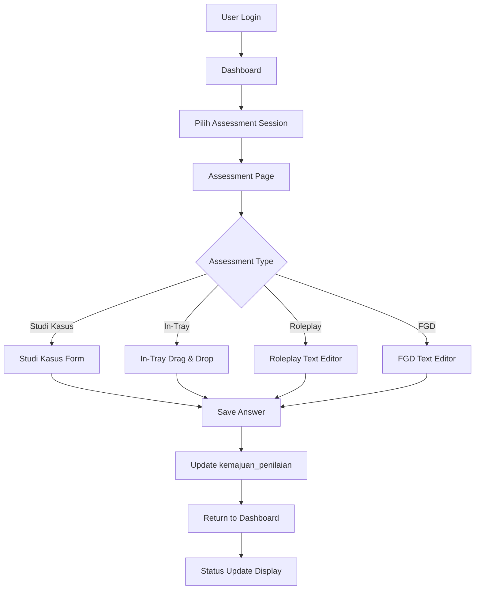

# Assessment Center

Aplikasi web "Assessment Center" untuk mengelola dan melaksanakan assessment kompetensi karyawan dengan fitur multi-step assessment dan timer yang dikendalikan admin.

## Teknologi

- **Backend**: Laravel 12
- **Database**: MySQL
- **Frontend**: Blade Templates + Tailwind CSS
- **Theme**: Video Game / Cyberpunk

## Fitur

### 👤 Fitur User (Peserta)

#### 1. Biodata
- User hanya bisa melihat biodata (read-only)
- Password peserta digenerate otomatis oleh sistem

#### 2. Assessment Multi-Step
- Peserta mengerjakan 4 jenis tes secara berurutan (stepper)
- Tiap jenis tes memiliki halaman/step sendiri
- User tidak bisa melompat ke step berikutnya sebelum step saat ini selesai
- Progress tracking dengan visual stepper

#### 3. Jenis Tes
- **Studi Kasus**: Soal narasi + jawaban text
- **In-Tray Exercise**: Urutkan 10-15 memo + berikan disposisi
- **Role-Play**: Instruksi/tugas (tanpa input jawaban)
- **FGD**: Instruksi/tugas (tanpa input jawaban)

#### 4. Timer & Auto-Save
- Timer yang dikendalikan admin
- Auto-save saat waktu habis
- Tombol "Simpan Sementara" dan "Simpan Final"
- Timestamp untuk setiap penyimpanan

### 🔧 Fitur Admin (Akan Dibangun)
- Manajemen peserta
- Setup assessment dan timer
- Monitoring progress peserta
- Download hasil assessment

## Alur Kerja Sistem Assessment

### 🔄 **Alur Kerja Umum**

1. **Admin membuat data peserta** → password digenerate otomatis → tersimpan di tabel users
2. **Admin setup assessment session** → buat sesi penilaian dengan timer dan peserta
3. **Admin input soal** (tiap jenis tes) → tersimpan di tabel assessments dan assessment_items
4. **Peserta login** → masuk dashboard berisi tombol assessment per sesi
5. **Peserta pilih assessment** → diarahkan ke halaman assessment sesuai jenis
6. **Peserta menjawab** → jawaban tersimpan dengan isolasi per sesi
7. **Saat tekan Simpan Sementara** → status = draft + timestamp simpan
8. **Saat tekan Simpan Final** → status = final + timestamp final + kemajuan_penilaian = selesai
9. **Timer diset oleh admin** di tabel assessment_sessions
10. **Saat admin start timer**, semua peserta bisa mengerjakan
11. **Saat admin stop timer**, semua peserta otomatis dihentikan

### 📊 **Alur Kerja Per Jenis Assessment**

#### **1. Studi Kasus**
```
User Action → Controller → Database
├── Simpan Sementara → saveJawabanStudiKasus → jawaban_studi_kasus (status: draft)
│                    → kemajuan_penilaian (status: sedang_berlangsung)
└── Simpan Final → saveJawabanStudiKasus → jawaban_studi_kasus (status: final)
                  → kemajuan_penilaian (status: selesai, waktu_selesai: now())
                  → Redirect ke dashboard
```

#### **2. In-Tray Exercise**
```
User Action → Controller → Database
├── Drag & Drop Memo → Frontend JavaScript → Update urutan prioritas
├── Input Disposisi → Frontend JavaScript → Update disposisi per memo
├── Simpan Sementara → saveJawabanInTray → jawaban_in_tray (status: draft)
│                    → kemajuan_penilaian (status: sedang_berlangsung)
└── Simpan Final → saveJawabanInTray → jawaban_in_tray (status: final)
                  → Update SEMUA memo menjadi final
                  → kemajuan_penilaian (status: selesai, waktu_selesai: now())
```

#### **3. Roleplay**
```
User Action → Controller → Database
├── Input Catatan → CKEditor → Frontend JavaScript
├── Simpan Sementara → saveCatatanRoleplay → catatan_roleplay (status: draft)
│                    → kemajuan_penilaian (status: sedang_berlangsung)
└── Simpan Final → saveCatatanRoleplay → catatan_roleplay (status: final)
                  → kemajuan_penilaian (status: selesai, waktu_selesai: now())
```

#### **4. FGD (Focus Group Discussion)**
```
User Action → Controller → Database
├── Input Catatan → CKEditor → Frontend JavaScript
├── Simpan Sementara → saveCatatanFgd → catatan_fgd (status: draft)
│                    → kemajuan_penilaian (status: sedang_berlangsung)
└── Simpan Final → saveCatatanFgd → catatan_fgd (status: final)
                  → kemajuan_penilaian (status: selesai, waktu_selesai: now())
```

### 🔐 **Isolasi Data Per Sesi**

#### **Multi-Session Support**
- Setiap peserta dapat mengikuti multiple assessment session
- Data jawaban terisolasi per `sesi_penilaian_id`
- Status kemajuan penilaian independen per sesi
- Dashboard menampilkan status per assessment per sesi

#### **Key Database Fields**
```sql
-- Semua tabel jawaban menggunakan composite key:
(peserta_id, penilaian_id, sesi_penilaian_id)

-- Tabel yang mendukung multi-session:
- jawaban_studi_kasus
- jawaban_in_tray  
- catatan_roleplay
- catatan_fgd
- kemajuan_penilaian
```

### 🎯 **Status Management**

#### **Status Kemajuan Penilaian**
- `belum_mulai` - Assessment belum dimulai
- `sedang_berlangsung` - Assessment dalam progress (ada jawaban draft)
- `selesai` - Assessment selesai (semua jawaban final)

#### **Status Jawaban Individual**
- `draft` - Jawaban sementara
- `final` - Jawaban final (tidak bisa diubah)

#### **Dashboard Status Display**
- 🔵 **Biru** - Belum mulai (`belum_mulai`)
- 🟡 **Kuning** - Sedang berlangsung (`sedang_berlangsung`)  
- 🟢 **Hijau** - Selesai (`selesai`)

### 🔄 **Data Flow Architecture**



## Setup & Instalasi

### 1. Clone Repository
```bash
git clone <repository-url>
cd assesmentdadakan
```

### 2. Install Dependencies
```bash
composer install
npm install
```

### 3. Konfigurasi Database
Buat file `.env` dengan konfigurasi:
```env
DB_CONNECTION=mysql
DB_HOST=127.0.0.1
DB_PORT=3306
DB_DATABASE=assessment_center
DB_USERNAME=root
DB_PASSWORD=
```

### 4. Generate App Key
```bash
php artisan key:generate
```

### 5. Jalankan Migration
```bash
php artisan migrate
```

### 6. Jalankan Seeder
```bash
php artisan db:seed
```

### 7. Jalankan Aplikasi
```bash
php artisan serve
npm run dev
```

## Data Sample

Aplikasi dilengkapi dengan data sample untuk 4 peserta:

### Peserta
1. **Ahmad Rizki** - PIN: 123456
2. **Siti Nurhaliza** - PIN: 234567  
3. **Budi Santoso** - PIN: 345678
4. **Dewi Sartika** - PIN: 456789

### Assessment Session
- **Assessment Center Batch 1 - 2024**
- Durasi: 120 menit
- Status: Pending (akan diaktifkan admin)

### Jenis Assessment
1. **Studi Kasus** - Manajemen Konflik (30 menit)
2. **In-Tray Exercise** - Prioritas Manajemen (45 menit)
3. **Role-Play** - Negosiasi dengan Klien (20 menit)
4. **FGD** - Inovasi dalam Pelayanan (25 menit)

## Struktur Database

### Tabel Utama
- `users` - Akun user (admin/participant)
- `peserta` - Biodata peserta
- `sesi_penilaian` - Session assessment dan timer
- `penilaian` - Jenis-jenis assessment
- `item_penilaian` - Item soal individual
- `kemajuan_penilaian` - Progress peserta per assessment per sesi
- `assessment_participant` - Relasi peserta dengan sesi assessment
- `sesi_assessment` - Relasi penilaian dengan sesi

### Tabel Jawaban (Multi-Session Support)
- `jawaban_studi_kasus` - Jawaban studi kasus (dengan sesi_penilaian_id)
- `jawaban_in_tray` - Jawaban in-tray exercise (dengan sesi_penilaian_id)
- `catatan_roleplay` - Catatan role-play (dengan sesi_penilaian_id)
- `catatan_fgd` - Catatan FGD (dengan sesi_penilaian_id)
- `latihan_in_tray` - Data memo untuk in-tray exercise

### Key Constraints & Indexes
```sql
-- Unique constraints untuk isolasi per sesi
ALTER TABLE kemajuan_penilaian 
ADD CONSTRAINT kemajuan_penilaian_session_unique 
UNIQUE (peserta_id, penilaian_id, sesi_penilaian_id);

-- Foreign key constraints
ALTER TABLE jawaban_studi_kasus 
ADD FOREIGN KEY (sesi_penilaian_id) REFERENCES sesi_penilaian(id);

ALTER TABLE jawaban_in_tray 
ADD FOREIGN KEY (sesi_penilaian_id) REFERENCES sesi_penilaian(id);

ALTER TABLE catatan_roleplay 
ADD FOREIGN KEY (sesi_penilaian_id) REFERENCES sesi_penilaian(id);

ALTER TABLE catatan_fgd 
ADD FOREIGN KEY (sesi_penilaian_id) REFERENCES sesi_penilaian(id);
```

## Routes

### Participant Routes
- `GET /participant/login` - Halaman login
- `POST /participant/login` - Proses login
- `GET /peserta/dashboard` - Dashboard peserta (dengan status per sesi)
- `GET /peserta/biodata` - Halaman biodata
- `GET /peserta/assessment-kerja/{id}?sesi={sesi_id}` - Halaman assessment kerja (In-Tray, Roleplay, FGD)
- `GET /peserta/assessment-studi-kasus/{id}?sesi={sesi_id}` - Halaman assessment studi kasus
- `POST /participant/logout` - Logout

### Assessment Save Routes
- `POST /penilaian/studi-kasus/{id}/save` - Simpan jawaban studi kasus
- `POST /penilaian/in-tray/{id}/save` - Simpan jawaban in-tray
- `POST /penilaian/roleplay/{id}/save` - Simpan catatan role-play
- `POST /penilaian/fgd/{id}/save` - Simpan catatan FGD

### Route Parameters
- `{id}` - ID penilaian (assessment)
- `?sesi={sesi_id}` - Query parameter untuk sesi penilaian
- Semua save routes menerima `sesi_penilaian_id` dalam request body

## Fitur Keamanan

- Session-based authentication
- CSRF protection
- Input validation
- Role-based access control (akan diimplementasikan)

## UI/UX Features

- **Responsive Design** - Mobile-friendly
- **Cyberpunk Theme** - Video game aesthetic
- **Real-time Timer** - Countdown dengan visual feedback
- **Progress Stepper** - Visual progress tracking
- **Auto-save** - Mencegah kehilangan data
- **Modern Interface** - Clean dan intuitive

## Fitur Terbaru & Perbaikan

### 🔧 **Perbaikan yang Telah Dilakukan**

#### **1. Isolasi Data Per Sesi**
- ✅ Semua tabel jawaban mendukung multiple assessment session
- ✅ Data terisolasi per `sesi_penilaian_id`
- ✅ Tidak ada data mixing antara sesi yang berbeda
- ✅ Unique constraint pada `(peserta_id, penilaian_id, sesi_penilaian_id)`

#### **2. Status Management yang Akurat**
- ✅ Status kemajuan penilaian: `belum_mulai`, `sedang_berlangsung`, `selesai`
- ✅ Status jawaban individual: `draft`, `final`
- ✅ Dashboard menampilkan status per assessment per sesi
- ✅ Tombol berwarna sesuai status (biru/kuning/hijau)

#### **3. In-Tray Assessment Enhancement**
- ✅ Drag & drop dengan auto-scroll
- ✅ Disposisi input per memo
- ✅ Logika khusus: semua memo harus final untuk status selesai
- ✅ Simpan final mengubah semua memo menjadi final

#### **4. WYSIWYG Editor Integration**
- ✅ CKEditor 5 Classic untuk Roleplay dan FGD
- ✅ Konsisten dengan Studi Kasus
- ✅ Auto-save dan draft management

#### **5. Session Management**
- ✅ Multi-session support
- ✅ URL parameter untuk sesi (`?sesi={id}`)
- ✅ Data attribute untuk frontend session tracking
- ✅ AJAX request dengan session context

### 🚀 **Technical Improvements**

#### **Database Schema Updates**
```sql
-- Migration files yang telah dijalankan:
- 2025_09_11_044657_add_sesi_penilaian_id_to_jawaban_in_tray_table
- 2025_09_11_044713_add_sesi_penilaian_id_to_catatan_roleplay_table  
- 2025_09_11_044719_add_sesi_penilaian_id_to_catatan_fgd_table
- 2025_09_11_052804_add_sesi_penilaian_id_to_kemajuan_penilaian_table
- 2025_09_11_054200_fix_kemajuan_penilaian_constraint
```

#### **Controller Updates**
- ✅ `PesertaController::showAssessmentKerja` - Multi-session support
- ✅ `PesertaController::dashboard` - Status mapping per sesi
- ✅ `PenilaianController::saveJawabanInTray` - Session isolation
- ✅ `PenilaianController::saveCatatanRoleplay` - Session isolation
- ✅ `PenilaianController::saveCatatanFgd` - Session isolation

#### **Frontend Enhancements**
- ✅ JavaScript session tracking dengan data attributes
- ✅ AJAX requests dengan session context
- ✅ CKEditor initialization dengan error handling
- ✅ Drag & drop dengan auto-scroll functionality
- ✅ Status-based UI updates

## Development Notes

- Aplikasi menggunakan Laravel 12 dengan fitur terbaru
- Frontend menggunakan Tailwind CSS untuk styling
- JavaScript vanilla untuk interaktivitas
- Database MySQL dengan relasi yang proper
- Seeder untuk data testing dan development
- **Multi-session architecture** dengan isolasi data per sesi
- **Real-time status tracking** dengan visual feedback
- **CKEditor 5 integration** untuk rich text editing
- **Drag & drop functionality** untuk In-Tray assessment

## Kontribusi

Untuk berkontribusi pada project ini:
1. Fork repository
2. Buat feature branch
3. Commit changes
4. Push ke branch
5. Buat Pull Request

## License

MIT License - lihat file LICENSE untuk detail.
